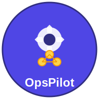
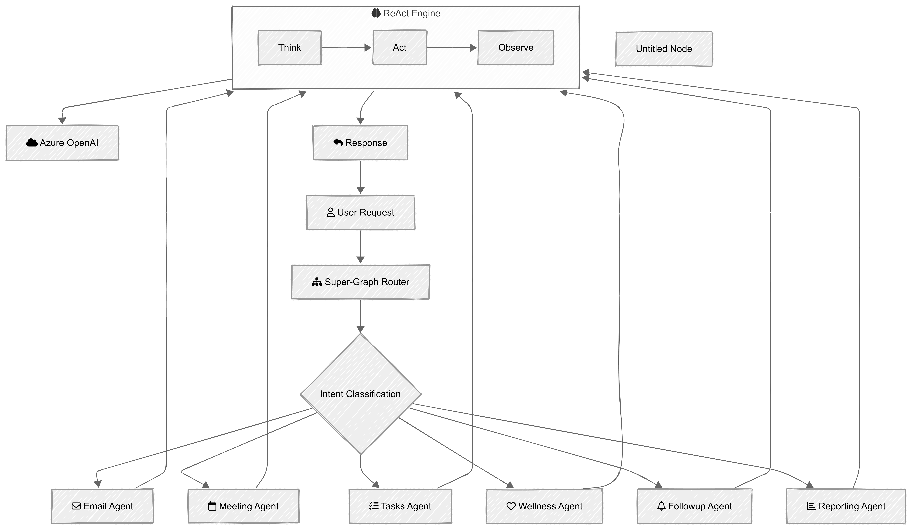

<div align="center">
  
# OpsPilot - Multi-Agent Workplace Automation System



*Intelligent Workplace Automation powered by Multi-Agent AI*

[](https://www.python.org/downloads/)
[](https://nextjs.org/)
[](https://github.com/langchain-ai/langgraph)
[](LICENSE)

</div>

---

A comprehensive AI-powered workplace automation platform leveraging multiple specialized agents orchestrated through LangGraph, with intelligent memory, caching, and governance systems.

## 🎯 Overview

OpsPilot is an intelligent workplace assistant that automates email triage, meeting management, task prioritization, follow-up tracking, wellness monitoring, and report generation using a multi-agent architecture with ReAct pattern implementation.

**Key Features:**
- 🤖 **6 Specialized Agents** - Email, Meeting, Tasks, Follow-up, Wellness, Reporting
- 🔄 **LangGraph Orchestration** - Dynamic agent routing and workflow management
- 🧠 **Vector Memory** - Semantic search and learning from past interactions
- 🛡️ **Governance Layer** - Policy enforcement, approvals, audit logging
- 📊 **Real-time Analytics** - Wellness scoring, productivity metrics, cost tracking
- 🎨 **Modern UI** - Next.js dashboard with real-time updates

## 📁 Project Structure

```
OpsPilot/
├── agents/                 # Specialized AI agents (ReAct pattern)
├── orchestration/          # LangGraph workflows & routing
├── backend/                # FastAPI server & API routes
├── frontend/               # Next.js web application
├── memory/                 # Vector store & episodic memory
├── governance/             # Policy, audit & cost management
├── repos/                  # Data access layer
├── config/                 # Configuration management
├── tests/                  # Test suites
├── chroma_db/              # Vector database persistence
└── episodes/               # Recorded agent episodes
```

## 🚀 Quick Start

### Prerequisites
- Python 3.10+
- Node.js 18+
- Git

### Backend Setup

```bash
cd backend
pip install -r requirements.txt
python app.py
```

Backend runs on `http://localhost:8002`

### Frontend Setup

```bash
cd frontend
npm install
npm run dev
```

Frontend runs on `http://localhost:3000`

## 🤖 Agents

| Agent | Purpose | Key Functions |
|-------|---------|---------------|
| **Email Agent** | Email triage & summarization | `summarize()`, `extract_actions()`, `draft_reply()` |
| **Meeting Agent** | Meeting management & MoM | `generate_mom()`, `extract_decisions()` |
| **Tasks Agent** | Task prioritization & tracking | `prioritize()`, `extract_actions()` |
| **Follow-up Agent** | Follow-up tracking & reminders | `check_followups()`, `create_nudge()` |
| **Wellness Agent** | Wellness scoring & recommendations | `calculate_score()`, `suggest_breaks()` |
| **Reporting Agent** | EOD/Weekly reports | `generate_eod_report()`, `generate_weekly_report()` |

## 📊 Technology Stack

### Backend
- **Framework**: FastAPI
- **Orchestration**: LangGraph
- **LLM**: Azure OpenAI / Claude
- **Memory**: ChromaDB + Custom Vector Store
- **Database**: JSON (mock data)
- **Cache**: LLM Response Cache

### Frontend
- **Framework**: Next.js + React
- **Styling**: Tailwind CSS
- **Language**: TypeScript
- **UI Components**: Shadcn/ui

### Infrastructure
- **Governance**: Policy enforcement, Rate limiting
- **Audit**: Complete audit trail logging
- **Monitoring**: LLM usage & cost tracking

## 🏗️ Architecture

### System Architecture Diagram

<div align="center">
  
  <p><em>High-level system architecture showing agent orchestration and data flow</em></p>
</div>

### Workflow Visualization

<div align="center">
  
  <p><em>LangGraph orchestration showing agent routing and decision flow</em></p>
</div>

### Data Flow

```
User Request
    ↓
[Super-Graph] → Intent Classification
    ↓
[Specialized Agent] → Processing (ReAct pattern)
    ↓
[Memory Layer] → Vector store + Episodic memory
    ↓
[Governance] → Approval gates + Audit logging
    ↓
API Response → UI Update
```

### State Management

- **Workflow State**: LangGraph
- **Agent Memory**: Episode storage (ChromaDB)
- **Vector Memory**: Semantic search & retrieval
- **API State**: Backend persistence

## 🔐 Security & Governance

- **Approvals**: Sensitive actions require human approval
- **Audit Trail**: Complete operation logging
- **Cost Management**: LLM token & cost tracking
- **Rate Limiting**: API and LLM rate limits
- **Policy Engine**: Configurable governance rules

## 📖 Documentation

- [ARCHITECTURE.md](./ARCHITECTURE.md) - Full system design & diagrams
- [CODEBASE_INDEX.md](./CODEBASE_INDEX.md) - Complete module reference
- [frontend/README.md](./frontend/README.md) - Frontend setup guide
- [backend/README.md](./backend/README.md) - Backend setup guide

## 🧪 Testing

```bash
# Run backend tests
cd backend
python -m pytest

# Run frontend tests
cd frontend
npm test
```

## 📊 Configuration

Configuration is centralized in `config/settings.py`:

```python
SETTINGS = {
    "env": "dev",          # dev, staging, prod
    "data": { ... },       # Data paths
    "governance": { ... }, # Policy settings
    "agents": { ... }      # Agent configuration
}
```

Use `.env.example` as a template for your environment setup.

## 🔄 Workflows

### Email Processing
1. Monitor inbox
2. Summarize & extract actions
3. Draft replies
4. Governance approval (if needed)
5. Store in memory for future reference

### Meeting Management
1. Schedule meeting
2. Generate minutes (MoM)
3. Extract decisions
4. Track follow-ups
5. Archive for future reference

### Task Management
1. Receive task request
2. Prioritize against workload
3. Assign resources
4. Track progress
5. Report completion

## 🚦 Environment Variables

Copy `.env.example` to `.env` and configure:

```bash
# LLM Configuration
AZURE_OPENAI_KEY=...
AZURE_OPENAI_ENDPOINT=...
AZURE_OPENAI_MODEL=...

# Data Configuration
DATA_DIR=./data/mock_data_json

# Server Configuration
API_PORT=8002
API_HOST=0.0.0.0

# Governance
ENABLE_APPROVALS=true
COST_LIMIT_USD=100
```

## 📈 Monitoring

Track agent performance and costs:

```bash
python print_graph.py    # View workflow graph
python show_tasks.py     # Display active tasks
```

## 🤝 Contributing

1. Create a feature branch
2. Make your changes
3. Test thoroughly
4. Submit a pull request

## 📝 License

[Add your license here]

## 👥 Team

[Add team information here]

## 📧 Support

For questions or issues:
- 📖 Check [CODEBASE_INDEX.md](./CODEBASE_INDEX.md)
- 🐛 Open an issue
- 💬 Start a discussion

---

**Last Updated:** February 5, 2026  
**Version:** 1.0.0
