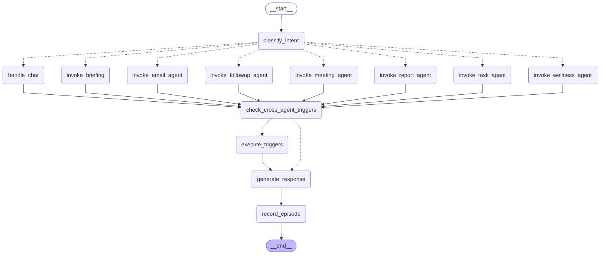

# Super-Graph Diagram

```mermaid
%%{init: {'flowchart': {'curve': 'linear'}}}%%
graph TD;
	__start__([<p>__start__</p>]):::first
	classify_intent(classify_intent)
	invoke_email_agent(invoke_email_agent)
	invoke_meeting_agent(invoke_meeting_agent)
	invoke_task_agent(invoke_task_agent)
	invoke_wellness_agent(invoke_wellness_agent)
	invoke_followup_agent(invoke_followup_agent)
	invoke_report_agent(invoke_report_agent)
	invoke_briefing(invoke_briefing)
	handle_chat(handle_chat)
	check_cross_agent_triggers(check_cross_agent_triggers)
	execute_triggers(execute_triggers)
	generate_response(generate_response)
	record_episode(record_episode)
	__end__([<p>__end__</p>]):::last
	__start__ --> classify_intent;
	execute_triggers --> generate_response;
	generate_response --> record_episode;
	handle_chat --> check_cross_agent_triggers;
	invoke_briefing --> check_cross_agent_triggers;
	invoke_email_agent --> check_cross_agent_triggers;
	invoke_followup_agent --> check_cross_agent_triggers;
	invoke_meeting_agent --> check_cross_agent_triggers;
	invoke_report_agent --> check_cross_agent_triggers;
	invoke_task_agent --> check_cross_agent_triggers;
	invoke_wellness_agent --> check_cross_agent_triggers;
	record_episode --> __end__;
	classify_intent -.-> invoke_email_agent;
	classify_intent -.-> invoke_meeting_agent;
	classify_intent -.-> invoke_task_agent;
	classify_intent -.-> invoke_wellness_agent;
	classify_intent -.-> invoke_followup_agent;
	classify_intent -.-> invoke_report_agent;
	classify_intent -.-> invoke_briefing;
	classify_intent -.-> handle_chat;
	check_cross_agent_triggers -.-> execute_triggers;
	check_cross_agent_triggers -.-> generate_response;
	classDef default fill:#f2f0ff,line-height:1.2
	classDef first fill-opacity:0
	classDef last fill:#bfb6fc

```
